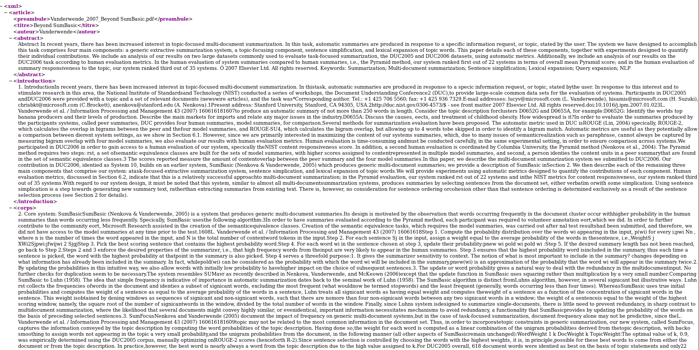
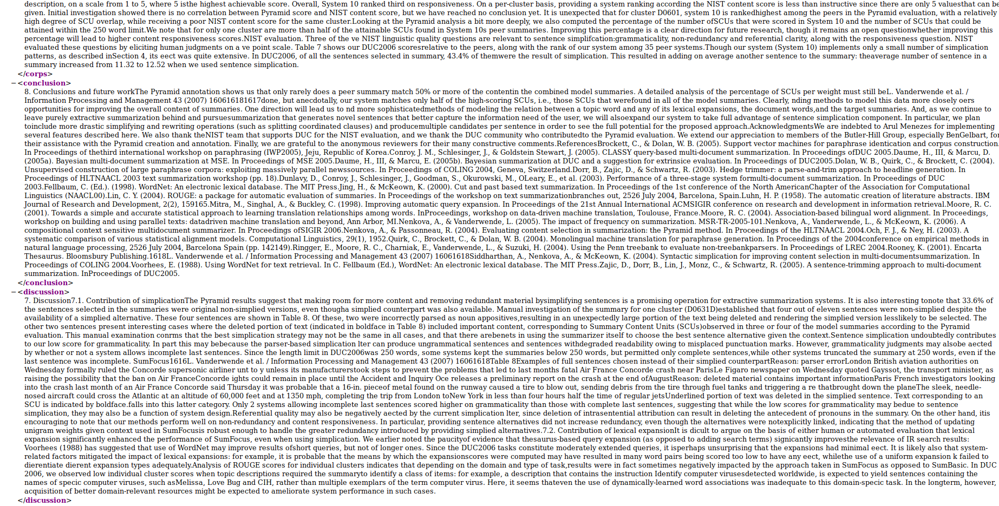
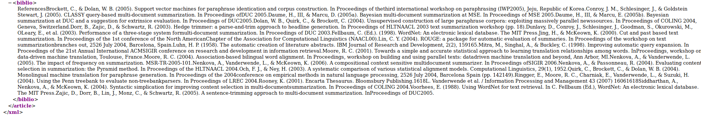
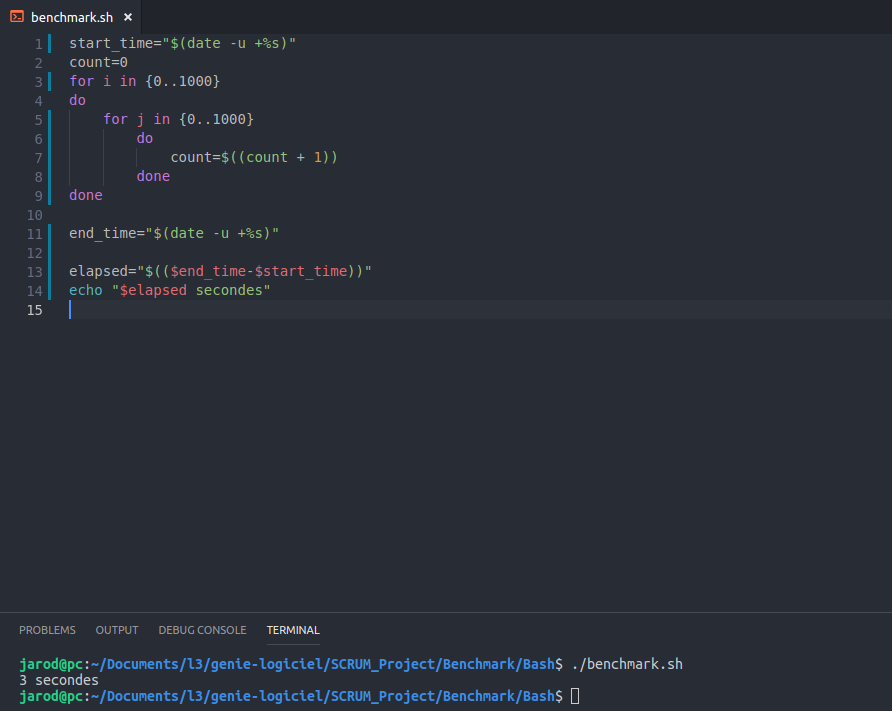
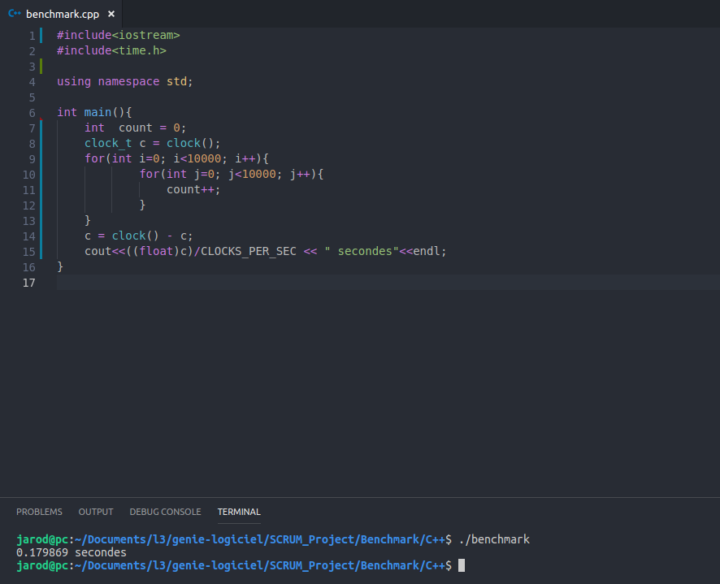
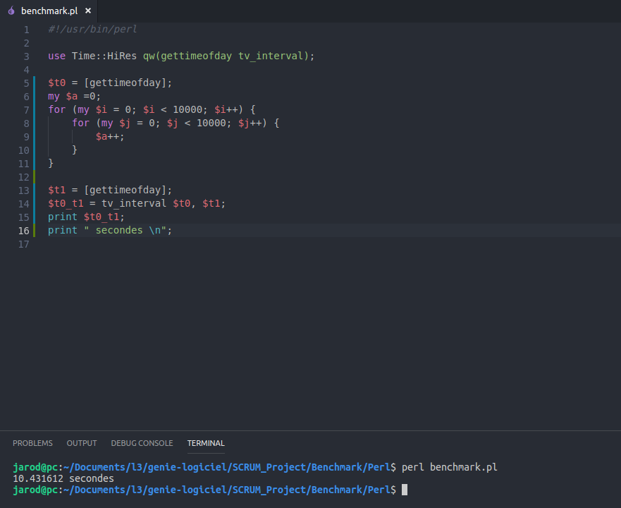
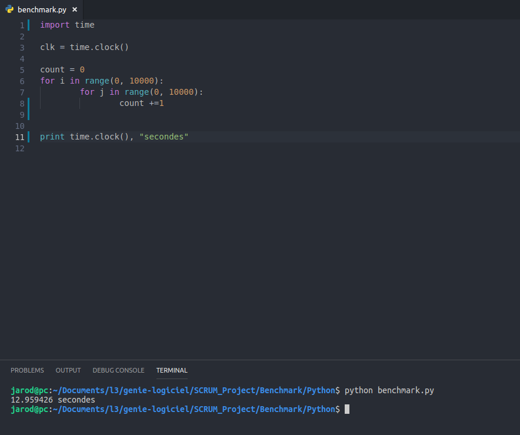
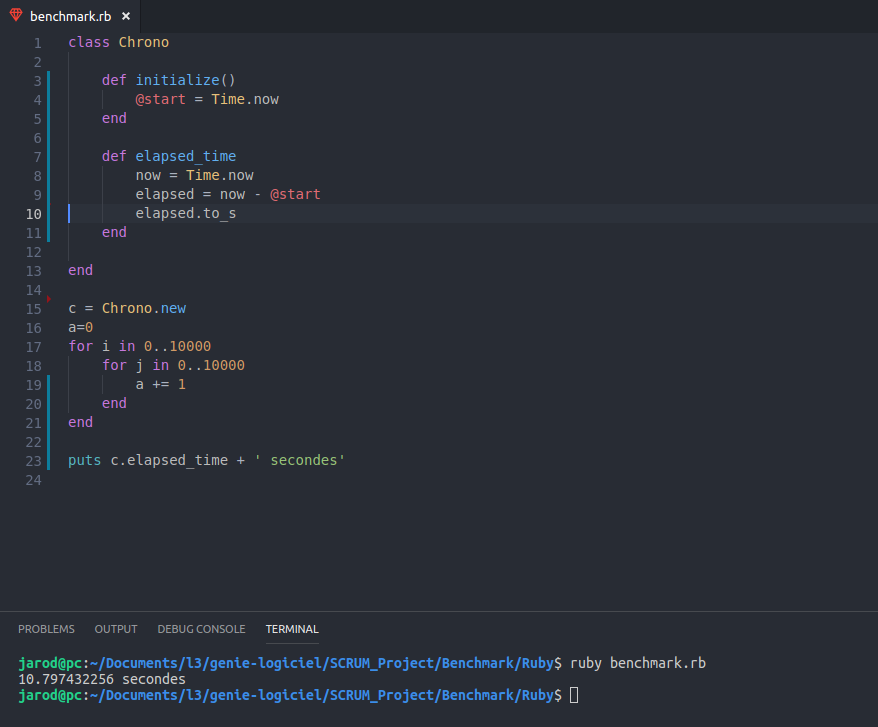
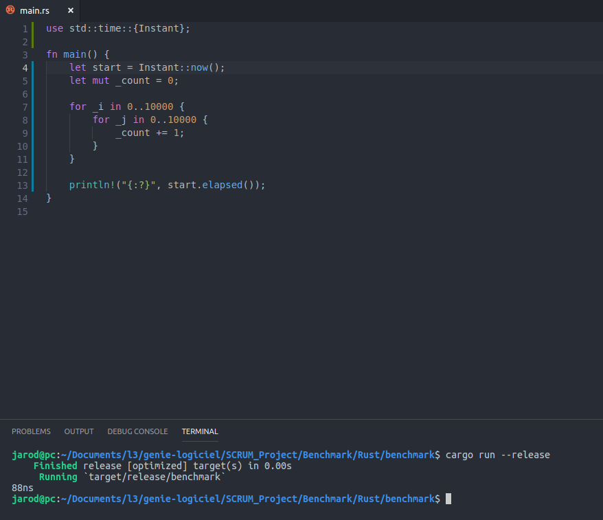

# SCRUM_Project

## PDF to text parser for LIA, organisation and brainstorming practise.

## Groupe 2

### Composition du groupe

* Duret Jarod
* Gueny Enzo
* Serghini Adam

### Lancement du programme

Pour lancer le parseur, il faut executer le lanceur.sh avec l' option -t (txt) ou -x (xml) et le chemin du dossier contenant les pdf.

ex: ./parseur.sh -x papersPDF/

Le lanceur ajoute deux dossiers papersTXT et papersXML en fonction des choix avec les fichiers correspondant. 

### Dependance

Python2: 
* glob
* re
* etree
### Choix du langage

Nous avons choisi le langage Rust et Python.

## Exemple d'un fichier de sortie xml 
 Le corps est raccourcis par le screen 

## Benchmark

Utilisation d' une double boucle de 10 000 iterations plus un compteur.

### Bash

Uniquement 1000 iterations car trop long.

### C++

### Perl

### Python

### Ruby

### Rust

## Ressources

Lien du rapport: <https://www.overleaf.com/5823369838yswnmyfkyfnr>
