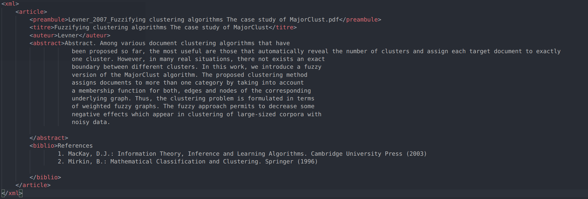

# SCRUM_Project

## PDF to text parser for LIA, organisation and brainstorming practise.

## Groupe 2

### Composition du groupe

* Duret Jarod
* Gueny Enzo
* Serghini Adam

### Choix du langage

Nous avons choisi le langage Rust et Python.

## Exemple d'un fichier de sortie xml

## Benchmark

Utilisation d' une double boucle de 10 000 iterations plus un compteur.

### Bash

Uniquement 1000 iterations car trop long.

### C++

### Perl

### Python

### Ruby

### Rust

## Ressources

Lien du rapport: <https://www.overleaf.com/5823369838yswnmyfkyfnr>
